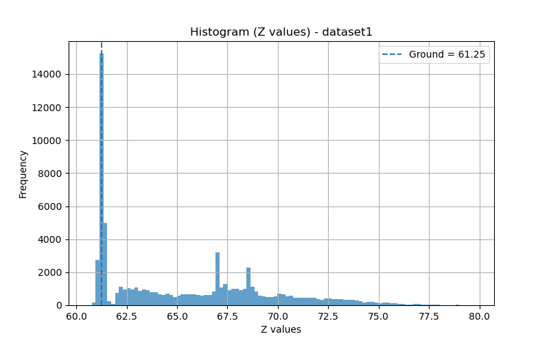
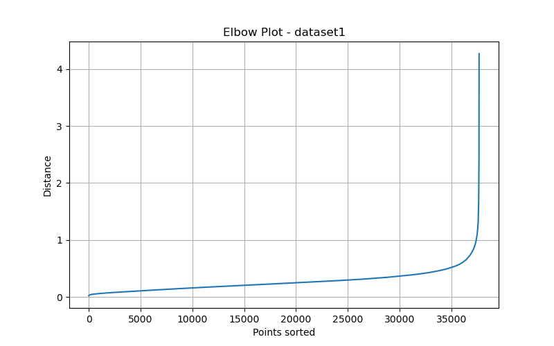
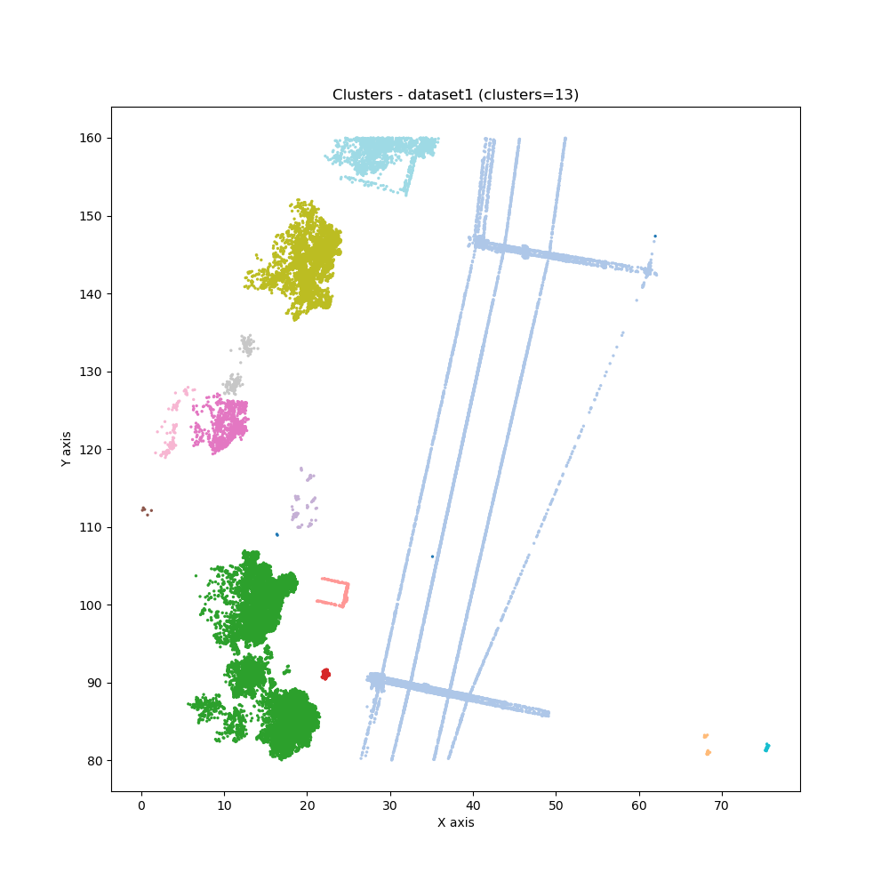
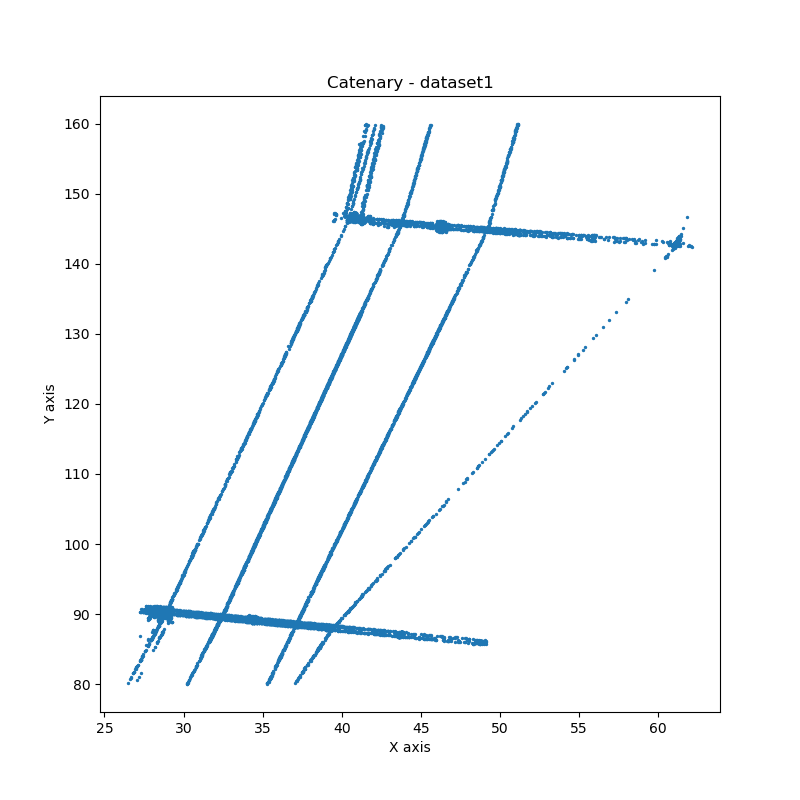
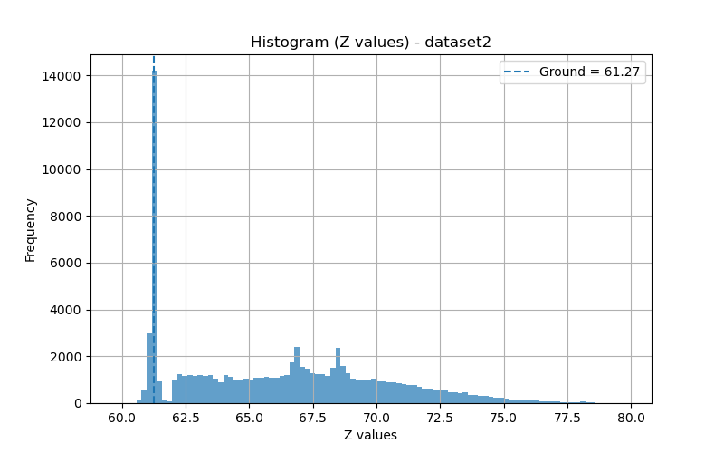
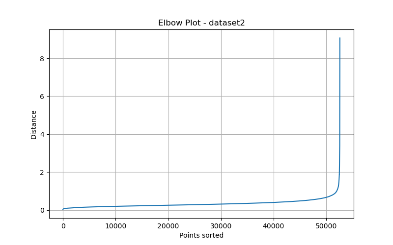
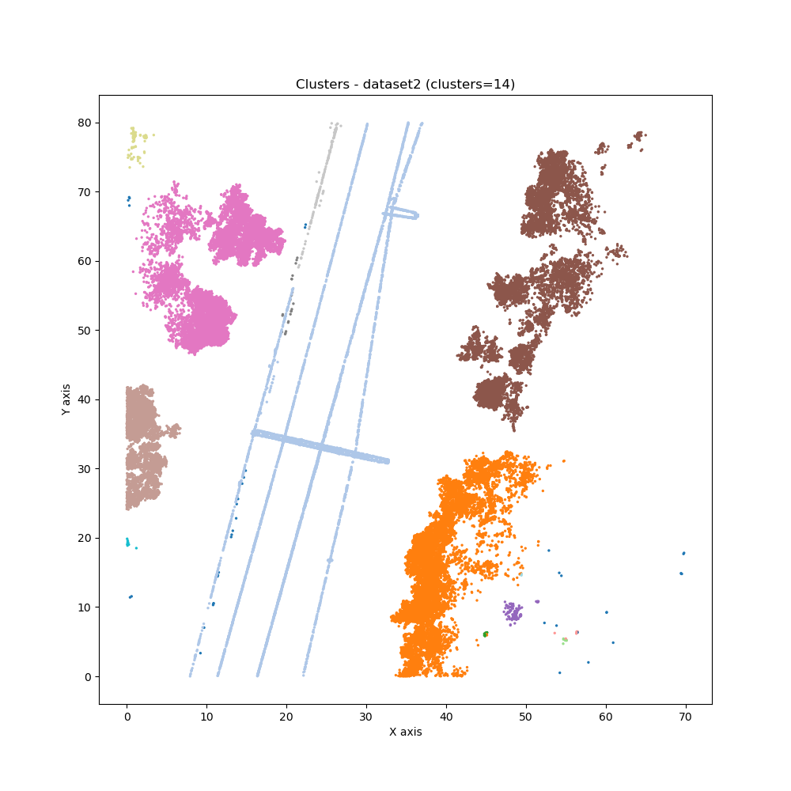
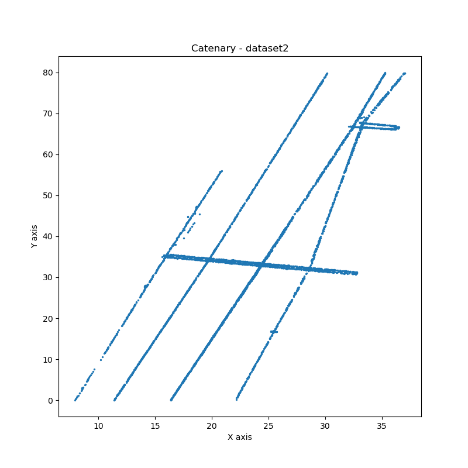

# Assignment 5

## 📊 Results

### Dataset 1
- Ground Level: 61.25  
- Optimized Epsilon: 2.5  

| Metric | Value |
|--------|-------|
| Min X  | 26.497 |
| Min Y  | 80.019 |
| Max X  | 62.140 |
| Max Y  | 159.959 |

---

### Dataset 2
- Ground Level: 61.27  
- Optimized Epsilon: 2.7  

| Metric | Value |
|--------|-------|
| Min X  | 7.939 |
| Min Y  | 0.009 |
| Max X  | 37.007 |
| Max Y  | 79.975 |

## 📷 Plots

### Dataset 1 Plot

### Dataset 2 Plot

